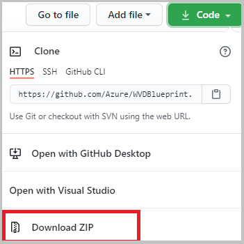

# Instructions for customizing Azure Windows Virtual Desktop to your environment, utilizing Azure Blueprints  

[Azure Blueprints](https://docs.microsoft.com/en-us/azure/governance/blueprints/overview) provide a structured approach to standing up new environments, while adhering to environment requirements.  Microsoft has created a set of Windows Virtual Desktop (WVD) Blueprint objects that help automate the creation of an entire environment, ready to run.  
Azure Blueprints utilize ["artifacts"](https://docs.microsoft.com/en-us/azure/governance/blueprints/overview#blueprint-definition), such as:

* Role Assignments
* Policy Assignments
* Azure Resource Manager (ARM) templates
* Resource Groups

The WVD Blueprints are meant to deploy an entire environment, including Azure Active Directory Domain Services (AAD DS), a management virtual machine (VM), networking, WVD infrastructure, and related resources, in a turn-key fashion.   The following is a guide to help accomplish customizing to your environment.  
## Recommended Reading

1) [Azure Blueprints] (<https://docs.microsoft.com/en-us/azure/governance/blueprints/overview>)
2) [Windows Virtual Desktop] (<https://docs.microsoft.com/en-us/azure/virtual-desktop/>)

## Prerequisites
1. **An [Azure Global Administrator](https://docs.microsoft.com/en-us/azure/active-directory/roles/permissions-reference) account**  
An Azure Global administrator account is required to successfully assign (deploy) the Azure WVD Blueprints.

1. **An [Azure Managed Identity](https://docs.microsoft.com/en-us/azure/active-directory/managed-identities-azure-resources/overview)**  
The Azure Managed Identity exists within Azure and can securely store and retrieve credentials from Azure Key Vault during the deployment. There are two types of Azure Managed Identies: 'System Assigned' and 'User Assigned'. For the purpose of this WVD Blueprint, the type 'User Assigned Managed Identity' will be utilized.  The instructions for creating a managed identity are here: **[Create a user-assigned managed identity](https://docs.microsoft.com/en-us/azure/active-directory/managed-identities-azure-resources/how-to-manage-ua-identity-portal#create-a-user-assigned-managed-identity)**  

    **NOTE:** In the case of “greenfield” deployments, the level of assignment will need to be the Azure subscription.  The WVD Blueprint, by default, creates objects at the subscription level during the blueprint deployment such as Azure AD DS.  
1. **Security configuration in the environment for a Blueprint Operator**  
The management of Blueprint definitions and Blueprint assignments are two different roles, thus the need for two different identities. A blueprint definition can use either system-assigned or user-assigned managed identities. However, when using the **Blueprint Operator** role, the blueprint definition needs to be configured to use a ***user-assigned managed identity***. Additionally, the account or security group being granted the Blueprint Operator role needs to be granted the Managed Identity Operator role on the user-assigned managed identity. Without this permission, blueprint assignments fail because of lack of permissions.  

    The high-level configuration steps are as follows (documentation [here](https://docs.microsoft.com/en-us/azure/governance/blueprints/how-to/configure-for-blueprint-operator)):  

    * [Create an Azure security group](https://docs.microsoft.com/en-us/azure/active-directory/fundamentals/active-directory-groups-create-azure-portal) (example: ‘Blueprint Operators’)  
    * At the subscription level, assign roles to the group previously created, by going to the following location in the Azure Portal  
    > **Azure Portal** -> **Home** -> **Subscriptions** -> (***your subscription***) -> **Access Control (IAM)**  
    * [Add the managed identity created in Step 2 of this document, and the Global Administrator accounts to the Azure security group](https://docs.microsoft.com/en-us/azure/active-directory/fundamentals/active-directory-groups-create-azure-portal#create-a-basic-group-and-add-members)  
    * Assign permissions to the group, to allow members to create objects at the subscription level:

        * [Blueprint Contributor](https://docs.microsoft.com/en-us/azure/role-based-access-control/built-in-roles#blueprint-contributor)
        * [Blueprint Operator](https://docs.microsoft.com/en-us/azure/role-based-access-control/built-in-roles#blueprint-operator)
        * [Managed Identity Operator](https://docs.microsoft.com/en-us/azure/role-based-access-control/built-in-roles#managed-identity-operator)  

    When correctly configured, the Role assignments for your Azure AD group, should look like this:  

    

1. **An [Azure subscription](https://azure.microsoft.com/en-us/free/) with sufficient credits to deploy the environment, and keep it running at the desired levels**  

1. **Azure Blueprint resource provider registered to your subscription** through Azure PowerShell with this PowerShell command:  

    ```PowerShell
    Register-AzResourceProvider -ProviderNamespace Microsoft.Blueprint
    ```

    You should receive this output from the Register-AzResourceProvider command:  

    ```ProviderNamespace   Microsoft.Blueprint  
    RegistrationState : Registering  
    ResourceTypes     : {blueprints, blueprints/artifacts, blueprints/versions, blueprints/versions/artifacts…}  
    Locations         : {}  
    ```

1. **Azure Active Directory provider registered to your subscription** (if not already registered):  
Check the current provider registration status in your subscription:  

    ```powershell
    Get-AzResourceProvider -ListAvailable | Select-Object ProviderNamespace, RegistrationState
    ```

    If necessary, register the Azure AD resource provider:

    ```powershell
    Register-AzResourceProvider -ProviderNamespace Microsoft.AAD
    ```

1. **[Domain Controller Services service principal](https://docs.microsoft.com/en-us/azure/active-directory/develop/howto-create-service-principal-portal)** (if it does not already exist), with this PowerShell command

    ```powershell
    New-AzureADServicePrincipal -AppId "2565bd9d-da50-47d4-8b85-4c97f669dc36"
    ```  

1. **Managed identity assigned the Owner role at the subscription level**  
The reason is that the managed identity needs full access during the deployment, for example to initiate the creation of an instance of Azure AD DS.  

    **MORE INFO:** [Add or change Azure subscription administrators](https://docs.microsoft.com/en-us/azure/cost-management-billing/manage/add-change-subscription-administrator)  

1. **The account used to assign the Blueprint, granted "User Access Administrator" at the subscription level**  
The account used to manage the subscription and later assign the Blueprint, should be assigned the "User Access Administrator". During Blueprint assignment users are going to be created and assigned to a WVD group. The "User Access Administrator" permission ensures the requisite permission in Azure AD to perform this function.  
 
    **MORE INFO:** [Assign a user as an administrator of an Azure subscription](https://docs.microsoft.com/en-us/azure/role-based-access-control/role-assignments-portal-subscription-admin)  

1. **The Blueprint main file, and related artifact objects**  
These objects are publicly available on Github.com. Once the Blueprint objects have been acquired, they need to be customized to each respective environment. The necessary customizations can be applied in a few different ways.  

## Blueprint Objects and Purpose

| Type | Object | Purpose |
|-|-|-|  
|Assignment file|assign_default.json|Hard-code and pass to the Blueprint, the environment specific items such as subscription, UserAssignedIdentity, etc.|  
|Blueprint file|Blueprint.json|The is the central file of an Azure Blueprint definition|
|Artifact|adds.json|directs the creation of Azure Active Directory Domain Services resources|
|Artifact|addsDAUser.json|directs the creation of domain administrator account|
|Artifact|DNSsharedsvcs.json|directs the creation of domain name services (DNS) resources|
|Artifact|keyvault.json|directs the creation of Azure Key Vault resources, used to store and retrieve credentials used at various points during the Blueprint assignment|
|Artifact|log-analytics.json|Sets up logging of various components to Azure storage|
|Artifact|MGMTVM.json|Sets up logging of various components to Azure storage|
|Artifact|net.json|Sets up networking and various subnets|
|Artifact|nsg.json|Sets up network security groups|
|Artifact|wvdDeploy.json|Deploys WVD session hosts, created the WVD host pool and application group, and adds the session hosts to the application group|
|Artifact|wvdTestUsers.json|Creates users in AAD DS, that are available to log in after the deployment is complete|

## Blueprint Parameters
Blueprint parameters, located in blueprint.json, allow to configure the deployment and customize the environment.

### Required Parameters
The blueprint includes the following required parameters.  

| Parameter | Example Value | Purpose |  
|-|-|-|  
|**adds_domainName**|wvdbp.contoso.com|The domainname for the Azure ADDS domain that will be created|
|**script_executionUserResourceID**|Resource ID Path|Resource ID for the Managed Identity that will execute embedded deployment scripts.|
|**script_executionUserObjectID**|xxxxxxxx-xxxx-xxxx-xxxx-xxxxxxxxxxxx|Object ID for the Managed Identity that will execute embedded deployment scripts.|
|**keyvault_ownerUserObjectID**|xxxxxxxx-xxxx-xxxx-xxxx-xxxxxxxxxxxx|Object ID of the user that will get access to the Key Vault. To retrieve this value go to Microsoft Azure Portal > Azure Active Directory > Users > (user) and copy the User’s Object ID.|

### Optional Parameters  

These optional parameters either have default values or, by default, do not have values. You can override them during the blueprint assigment process.  

| Parameter | Default Value | Purpose |
|-|-|-|
|**resourcePrefix**|WVD|A text string prefixed to the begining of each resource name.|
|**adds_emailNotifications**|wvdbpadmin@contoso.com|An email account that will receive ADDS notifications|
|**_ScriptURI**|https://raw.githubusercontent.com/Azure/WVDBlueprint/main/scripts|URI where Powershell scripts executed by the blueprint are located.|
|**log-analytics_service-tier**|PerNode|Log Analytics Service tier: Free, Standalone, PerNode or PerGB2018.|
|**log-analytics_data-retention**|365|Number of days data will be retained.|
|**nsg_logs-retention-in-days**|365|Number of days nsg logs will be retained.|
|**vnet_vnet-address-prefix**|10.0.0.0/16|Address prefix of the vnet created by the WVD Blueprint.|
|**vnet_enable-ddos-protection**|true|Determines whether or not DDoS Protection is enabled in the Virtual Network.|
|**vnet_sharedsvcs-subnet-address-prefix**|10.0.0.0/24|Shared services subnet address prefix.|
|**vnet_adds-subnet-address-prefix**|10.0.6.0/24|Subnet for Azure ADDS.|
|**vnet_logs-retention-in-days**|365|Number of days vnet logs will be retained.|
|**keyvault_logs-retention-in-days**|365|Number of days keyvault logs will be retained.|
|**daUser_AdminUser**|domainadmin@{adds_domainName}|This account will be a member of AAD DC Administrators and Local Admin on deployed VMs.|
|**wvdHostpool_hostpoolname**|{resourcePrefix}-wvd-hp||
|**wvdHostpool_workspaceName**|{resourcePrefix}-wvd-ws||
|**wvdHostpool_hostpoolDescription**|||
|**wvdHostpool_vmNamePrefix**|{resourcePrefix}vm|Prefix added to each WVD session host name.|
|**wvdHostpool_vmGalleryImageOffer**|office-365||
|**wvdHostpool_vmGalleryImagePublisher**|MicrosoftWindowsDesktop||
|**wvdHostpool_vmGalleryImageSKU**|20h1-evd-o365pp||
|**wvdHostpool_vmImageType**|Gallery||
|**wvdHostpool_vmDiskType**|StandardSSD_LRS||
|**wvdHostpool_vmUseManagedDisks**|true||
|**wvdHostpool_allApplicationGroupReferences**|||
|**wvdHostpool_vmImageVhdUri**||(Required when vmImageType = CustomVHD) URI of the sysprepped image vhd file to be used to create the session host VMs.|
|**wvdHostpool_vmCustomImageSourceId**||(Required when vmImageType = CustomImage) Resource ID of the image.|
|**wvdHostpool_networkSecurityGroupId**||The resource id of an existing network security group.|
|**wvdHostpool_personalDesktopAssignmentType**|||
|**wvdHostpool_customRdpProperty**||Hostpool rdp properties.|
|**wvdHostpool_deploymentId**|||
|**wvdHostpool_ouPath**|||
|**wvdUsers_userPrefix**|user|Username prefix. A number will be added to the end of this value.|
|**wvdUsers_userCount**|10|Total Number of WVD users to create.|

## Import, Publish and Assign the Blueprint

1. Import the Blueprint - <https://docs.microsoft.com/en-us/azure/governance/blueprints/how-to/import-export-ps>
2. Publish the Blueprint - <https://docs.microsoft.com/en-us/azure/governance/blueprints/create-blueprint-portal>
3. Assign the Blueprint - <https://docs.microsoft.com/en-us/azure/governance/blueprints/create-blueprint-portal>

**NOTE:** The following two sections are two methods available to assign the WVD Blueprint.  You can select one or the other, you do not have to do both.

### Manage the Blueprint using Azure Cloud Shell
Azure hosts Azure Cloud Shell, an interactive shell environment that can be used through a web browser.
You can use either Bash or PowerShell with Cloud Shell to work with Azure services.
You can use the Cloud Shell preinstalled commands to import and assign the WVD Blueprint without having to install anything on your local environment.  
There are several ways to get started with Azure Cloud Shell:  

1. Start Azure CloudShell:  

    - **Direct link**: Open a browser to [https://shell.azure.com](https://shell.azure.com).

    - **Azure portal**: Select the Cloud Shell icon on the [Azure portal](https://portal.azure.com):

      

1. Start PowerShell in Azure CloudShell ([more information here](https://docs.microsoft.com/en-us/azure/cloud-shell/overview#choice-of-preferred-shell-experience))

1. Run the following command to clone the Azure WVDBlueprint repository to CloudDrive.  

    ```dos
    git clone https://github.com/Azure/WVDBlueprint.git $HOME/clouddrive/WVDBlueprint
    ```

    **TIP:**  Run ```dir $HOME/clouddrive``` to verify the repository was successfully cloned to your CloudDrive  

1. Run the following commands to import the required PowerShell modules needed to import the blueprint (if not previously installed)

    ```PowerShell
    Install-Module -Name Az.Blueprint
    Import-Module Az.Blueprint
    ```

1. Run the following command to import the WVD Blueprint definition, and save it within the specified subscription or management group.  

    ```powershell
    Import-AzBlueprintWithArtifact -Name "YourBlueprintName" -SubscriptionId "00000000-1111-0000-1111-000000000000" -InputPath "$HOME/clouddrive/WVDBlueprint/blueprint"
    ```  

    **NOTE:** The '-InputPath' argument must point to the folder where blueprint.json file is placed.

1. From the Azure Portal, browse to [Azure Blueprint service tab](https://portal.azure.com/#blade/Microsoft_Azure_Policy/BlueprintsMenuBlade/GetStarted) and select "**Blueprint definitions**".  
You can review newly imported Blueprint definitions and follow instructions to edit, publish and assign blueprint. ([More information](https://docs.microsoft.com/en-us/azure/governance/blueprints/create-blueprint-portal#edit-a-blueprint))  

### Manage the Blueprint using local storage on a device (Windows instructions)  

You can manage the WVD Blueprint using a device that has a small amount of local storage available.

1. Go the [WVD Blueprint Github repository main folder](https://github.com/Azure/WVDBlueprint).  

1. Click or tap the down arrow on the green button called 'Code', then tap or click the option 'Download Zip'.  

        

1. Once the .zip file is downloaded to your local device, you can expand the contents to any location of your choosing,
by double-clicking the downloaded .zip file, and then copying the main folder within the zip to any location, such as 'C:\WVDBlueprint-main'.  

1. The next step is to import the Blueprint to your Azure subscription. These are the high-level steps to import the Blueprint:

    * Start PowerShell.
    * Run the following PowerShell commands to import the required modules needed to import the blueprint (if not previously installed)

    ```PowerShell
    Install-Module -Name Az.Blueprint
    Import-Module Az.Blueprint
    ```  

    **NOTE:** Installing the PowerShell 'Az' modules does not include the Az.Blueprint modules. If you have installed the 'Az' modules, you will still need to install the Az.Blueprint modules.  

1. Authenticate to your subscription by using the following PowerShell command

    ```powershell
    Connect-AzAccount
    ```

1. Run the following command to import the Blueprint to your Azure subscription:  

    ```powershell    
    Import-AzBlueprintWithArtifact -Name "YourBlueprintName" -SubscriptionId "00000000-1111-0000-1111-000000000000" -InputPath 'C:\WVDBlueprint-main\Blueprint'
    ```

1. From the Azure Portal, browse to [Azure Blueprint service tab](https://portal.azure.com/#blade/Microsoft_Azure_Policy/BlueprintsMenuBlade/GetStarted) and select "**Blueprint definitions**".  
You can review newly imported Blueprint definitions and follow instructions to edit, publish and assign blueprint. ([More information](https://docs.microsoft.com/en-us/azure/governance/blueprints/create-blueprint-portal#edit-a-blueprint))  

## Teardown

If an environment built by this blueprint is no longer needed, a script is provided in the Resources folder that will export logs found in a WVD Blueprint deployment's Log Analytics Workspace to a csv file stored in the directory specified at runtime.  

The script finds and removes the following items that were previously deployed via WVD Blueprint:

* All SessionHosts and HostPools in a ResourceGroup based on resource prefix
* All users discovered in 'WVD Users' group
* 'WVD Users' group itself
* 'AAD DC Admins' group

Use of `-verbose`, `-whatif` or `-comfirm` ARE supported. Also, the script will create one Powershell Job for each Resource Group being removed. Teardowns typically take quite some time, so this will allow you to return to prompt and keep working while the job runs in the background.  

**Example:**

```powershell
#Exports logs of a WVD Blueprint deployment that used the prefix "ABC" followed by a removal:
.\Remove-AzWvdBpDeployment.ps1 -Verbose -Prefix "ABC" -LogPath "C:\projects"

#Use help for more details or examples:  
help .\Remove-AzWvdBpDeployment.ps1
```

## Tips

* About the Group Policy settings that are applied to the WVD session host computers, during the Blueprint deployment. There are two 
sections of Group Policy settings applied to the WVD session hosts:  

    - **FSLogix settings**
    - **"RDP session host lockdown" settings**  

The FSLogix are there to enable the FSLogix profile management solution.  During Blueprint deployment, some of the parameters are evaluated and used to create a variable for the FSLogix profile share UNC, as it exits in this particular deployment.  That value is then written to a new GPO that is created just prior to the share UNC enumeration, and is only applied to an OU object, also created prior to the share UNC enumeration.  
With respect to the **"RDP session host lockdown"** settings, those are set by default, based on various security recommendations, made by Microsoft and others. The **"RDP session host lockdown** settings are all set in a script file called **'Create-AzAADDSJoinedFileshare.ps1'**.  There is one setting that is not available in that file, which is a Group Policy start script entry, for a script that is downloaded and run by each WVD session host, on their next Startup ***after they have received and applied their new group policy***.  Here is the workflow of the chain of events that lead up to the session hosts becoming fully functional.

1. WVD Session Hosts are created, and joined to the AAD DS domain.  This happens in the artifact **"WVDDeploy.json"**.
2. Later the "management VM" is created, and joined to the domain.  This domain join triggers a reboot, and the JoinDomain extension waits for the machine to reboot and check in before the "MGMTVM" artifact continues.
3. After the management VM reboots, the next section of "MGMTVM" artifact initiates running a custom script, which is downloaded from Azure storage, to the management VM.
4. The Managment VM runs the 'Create-AzAADDSJoinedFileshare.ps1' script, which has two sections: 1) Create storage for FSLogix, 2) Run the domain management code
5. The domain management code does the following for the session hosts:
    1. Creates a new GPO called **"WVD Session Host policy"**        
    2. Creates a new OU called **"WVD Computers"**
    3. Links the WVD GPO to the WVD OU
    4. Restores a previous GP export, which imports a Startup script, and also copies that Startup script to the current location in SYSVOl policies
    5. Moves only the WVD session host computer objects to the new WVD OU
    6. Invokes a command to each VM in the WVD OU, to immediately refresh Group Policy
    7. Invokes a command to each VM in the WVD OU, to reboot with a 5 second delay, so that the VMs can run the FSLogix startup script, which installs the FSLogix software.
        
Now for the tip.  If there is a particular setting that you do not want to apply, you could download a copy of the script **'Create-AzAADDSJoinedFileshare.ps1'**.  Then you can customize the script file by editing out the line that applies a particular group policy setting that you may not want to apply to the WVD sessions host.  An example will be listed just below.  
So that the WVD session hosts can be customized to your environment, you would then create an Azure storage container, set to anonymous access, then upload your script to that location.  
Lastly, you would edit the Blueprint artifact file "MGMTVM", currently line 413.  But that section looks like this:

        "properties": {
          "publisher": "Microsoft.Compute",
          "type": "CustomScriptExtension",
          "typeHandlerVersion": "1.7",
          "autoUpgradeMinorVersion": true,
          "settings": {
            "fileUris": [
                "https://agblueprintsa.blob.core.windows.net/blueprintscripts/Create-AzAADDSJoinedFileshare.ps1"  

You would edit the value inside the quotes, to point to your specific storage location.  For example, you might change yours to something like this:

            "fileUris": [
                "https://contosoblueprintsa.blob.core.windows.net/blueprintscripts/Create-AzAADDSJoinedFileshare.ps1"

Lastly, you would edit the script **'Create-AzAADDSJoinedFileshare.ps1'** to remove the setting you are interested in.  Here are the settings details:  

### RDP Redirection Settings  

```powershell
Set-GPRegistryValue -Name "WVD Session Host Policy" -Key "HKLM\SOFTWARE\Policies\Microsoft\Windows NT\Terminal Services" -Type DWORD -ValueName "fDisableAudioCapture" -Value 1  
Set-GPRegistryValue -Name "WVD Session Host Policy" -Key "HKLM\SOFTWARE\Policies\Microsoft\Windows NT\Terminal Services" -Type DWORD -ValueName "fDisableCameraRedir" -Value 1  
Set-GPRegistryValue -Name "WVD Session Host Policy" -Key "HKLM\SOFTWARE\Policies\Microsoft\Windows NT\Terminal Services" -Type DWORD -ValueName "fDisableCcm" -Value 1  
Set-GPRegistryValue -Name "WVD Session Host Policy" -Key "HKLM\SOFTWARE\Policies\Microsoft\Windows NT\Terminal Services" -Type DWORD -ValueName "fDisableCdm" -Value 1  
Set-GPRegistryValue -Name "WVD Session Host Policy" -Key "HKLM\SOFTWARE\Policies\Microsoft\Windows NT\Terminal Services" -Type DWORD -ValueName "fDisableClip" -Value 1  
Set-GPRegistryValue -Name "WVD Session Host Policy" -Key "HKLM\SOFTWARE\Policies\Microsoft\Windows NT\Terminal Services" -Type DWORD -ValueName "fDisableLPT" -Value 1  
Set-GPRegistryValue -Name "WVD Session Host Policy" -Key "HKLM\SOFTWARE\Policies\Microsoft\Windows NT\Terminal Services" -Type DWORD -ValueName "fDisablePNPRedir" -Value 1  
Set-GPRegistryValue -Name "WVD Session Host Policy" -Key "HKLM\SOFTWARE\Policies\Microsoft\Windows NT\Terminal Services" -Type DWORD -ValueName "fEnableTimeZoneRedirection" -Value 1
```
The group policy settings come from Microsoft documentation: [Group Policy Settings Reference Spreadsheet for Windows 10 ...](https://www.microsoft.com/en-us/download/101451).


* [Visual Studio Code](https://code.visualstudio.com/) is a Microsoft provided suite available for editing, importing, and assigning the Blueprints. If using VS Code, the following extensions will greatly assist the efforts:|

  * Azure Resource Manager Tools  
  * XML Formatter  
  * PowerShell extension (so that all work can be performed within one tool)  

   There may be other extensions available that perform the same functionality

* To store scripts and any other objects needed during Blueprint assignment on Internet connected assigments, a publically web location can be used to store scripts and other objects needed during Blueprint assigment.  
[Azure Storage Blob](https://azure.microsoft.com/en-us/services/storage/blobs/) is one possible method to make the scripts and other objects available.
Whatever method chosed, the access method should be "public" and "anonymous" read-only access.

* If you need to delete a deployment with the intent of starting over with a new deployment, you will need to change the "Deployment Prefix" value in the "assign_default.json" file.
  This file is used to prefix most of the Azure resources created during the deployment, including an [Key Vault](https://azure.microsoft.com/en-us/services/key-vault/) object.
  Azure Key Vault is used to store and retrieve cryptogrphic keys used by cloud apps and services, and as such is treated with great care in Azure.
  When an Azure Key Vault is deleted, it transitions to a "soft delete" state for a period of time, before actually being deleted.
  While an Azure Key Vault is in soft delete state, another key vault cannot be created with the same name.  Therefore, if you do not change your
  Resource Prefix value for subsequent deployments, the subsequent deployments will fail with an error referencing Key Vault name.
  
* Create a Resource Group for your Blueprint resources
During the Blueprint deployment process, you will be creating some resources that you may want to retain after the blueprint has been deployed.
Depending on various factors, you may create a managed identity, a storage blob, etc. To that end, you could create a resource group, and in that resource group you only create items that are related to your Blueprint work. Another reason for this is that you can build and deconstruct a Blueprint, over and over, yet retain some of the core objects necessary, which will save time and effort.  

    Example: WVDBlueprint-RG

* Development and/or Production environments can be used to work with the Blueprint code
Development environments are well suited to streamlining workflows such as [“import”](https://docs.microsoft.com/en-us/azure/governance/blueprints/how-to/import-export-ps) and [“assign”](https://docs.microsoft.com/en-us/azure/governance/blueprints/how-to/manage-assignments-ps) the Blueprints.
PowerShell or CloudShell can be utilized for various tasks. If using PowerShell, you may need to import the [Az.Blueprint module](https://docs.microsoft.com/en-us/azure/governance/blueprints/how-to/manage-assignments-ps#add-the-azblueprint-module) for PowerShell.

## Trademarks

This project may contain trademarks or logos for projects, products, or services. Authorized use of Microsoft trademarks or logos is subject to and must follow  [Microsoft's Trademark & Brand Guidelines](https://www.microsoft.com/en-us/legal/intellectualproperty/trademarks/usage/general) . Use of Microsoft trademarks or logos in modified versions of this project must not cause confusion or imply Microsoft sponsorship. Any use of third-party trademarks or logos are subject to those third-party's policies.

## Disclaimer
This Sample Code is provided for the purpose of illustration only and is not intended to be used in a production environment.
THIS SAMPLE CODE AND ANY RELATED INFORMATION ARE PROVIDED "AS IS" WITHOUT WARRANTY OF ANY KIND, EITHER EXPRESSED OR IMPLIED, INCLUDING BUT NOT LIMITED TO THE IMPLIED WARRANTIES OF MERCHANTABILITY AND/OR FITNESS FOR A PARTICULAR PURPOSE. We grant You a nonexclusive, royalty-free right to use and modify the Sample Code and to reproduce and distribute the object code form of the Sample Code, provided that You agree: (i) to not use Our name, logo, or trademarks to market Your software product in which the Sample Code is embedded; (ii) to include a valid copyright notice on Your software product in which the Sample Code is embedded; and (iii) to indemnify, hold harmless, and defend Us and Our suppliers from and against any claims or lawsuits, including attorneys’ fees, that arise or result from the use or distribution of the Sample Code.

Microsoft provides programming examples for illustration only, without warranty either expressed or implied, including, but not limited to, the implied warranties of merchantability and/or fitness for a particular purpose.

This sample assumes that you are familiar with the programming language being demonstrated and the tools used to create and debug procedures. Microsoft support professionals can help explain the functionality of a particular procedure, but they will not modify these examples to provide added functionality or construct procedures to meet your specific needs. if you have limited programming experience, you may want to contact a Microsoft Certified Partner or the Microsoft fee-based consulting line at (800) 936-5200
